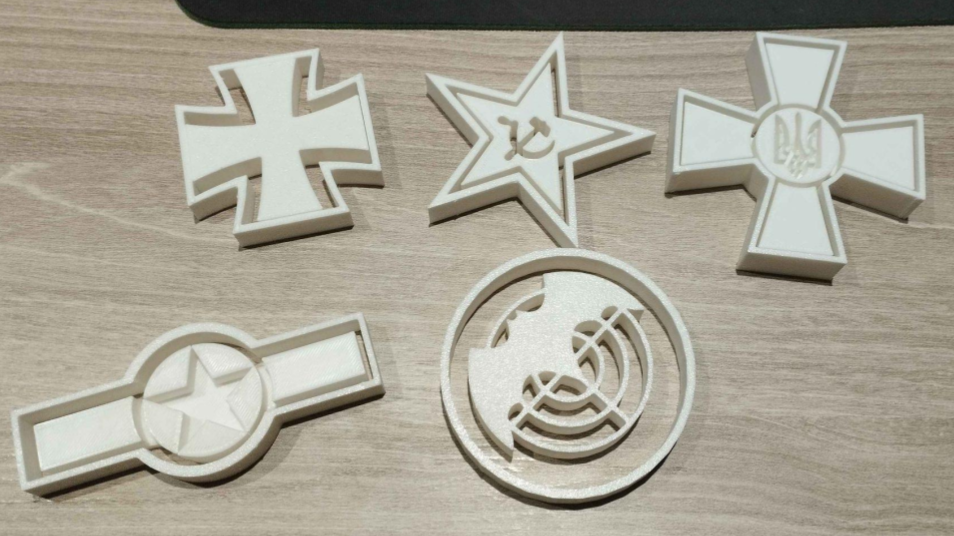

# Military Insignia Cookie Cutters 2024

## Five 3D printer cookie cutter models in the shape of various aircraft and army insignias.

This project was mostly made for fun and is a set of .STL files of cookie cutters in the shape of military insignias.

**These models include the insignias of the following:**
- Vietnam People's Air Force
- The Luftwaffe's Iron Cross
- Armed Forces of Ukraine
- The Red Army
- Spetnaz GRU (I removed the text from the inner cookie imprinter)

**How to use the cookie cutters**:
1. Firstly, roll out your preferred cookie dough to your desired thickness (I recommend a dough that holds its shape well).
2. From there, use the outside part of your chosen cookie cutter to cut out the outline of the cookie dough.
3. Finally, use the middle part of the cookie cutter (that being the imprinter), align it with the cookie cutter, and press down gently just enough to add an imprint on the cookie and nothing further.
4. Repeat to your heart's desire.
5. Place them on a baking tray lined with baking paper and cook them based on recipe instructions
6. Add icing if you want and enjoy!

**NOTE:** Remember to thoroughly remove any stringing and imperfections from the models to make sure no plastic ends up in your cookies.

**I do not recommend using these cookie cutters more than once unless you take extra precautions to fully seal up the model and make it food safe, as tiny pieces of cookie dough can get stuck between the tiny gaps of the model and lead to bacteria growth later on.**

Print settings used: 0.2mm layer height, 15% infil (Will probably work at smaller layer heights and higher infil percentages)
Printer used: Anycubic Kobra 2 Plus

This repository is licensed under the MIT License, so if for whatever reason you wanted to use my models, you are welcome to do so as long as I'm credited.